## INSTALLING THE NGINX WEV SERVER

## *Displaying web pages to site visitors*

`In order to allow visitors to see my web pages, I need to install nginx.`
`However, before installing nginx, I updated my server by running command "sudo apt update" and the output displayed in the image below was generated`

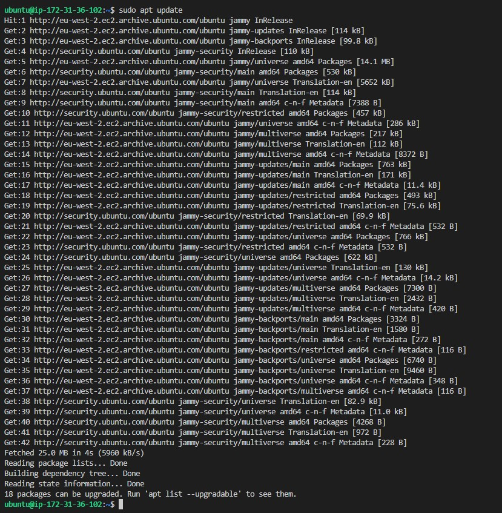

`After the server has been updated, I run command "sudo apt install nginx" and the output generated is presented in the image below:`

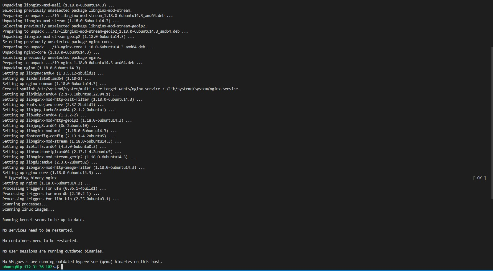

`To confirm ngnix installation, I run command "Sudo systemctl status nginx" and the output in the image below was generated`

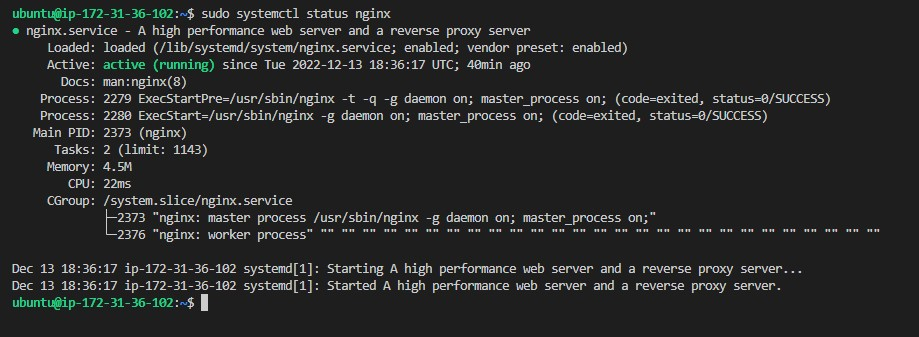

## *opening TCP port 80*

`In order to receive traffic by the web server, I opened TCP port 80 on my ubuntu server by running command "curl http://localhost:80" and I generated the output in the image shown below:`

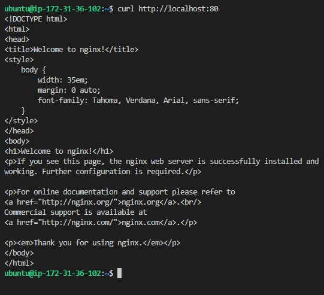

`I checked if my installation is working well by browsing http://(my ip address):80 on my browser and I got the image below from my browser.`

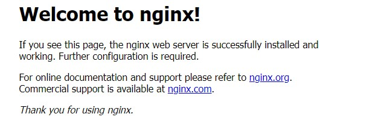


## INSTALLING MYSQL

`To install mysql, I run command "sudo apt install mysql-server" and I got the output displayed in the images below`

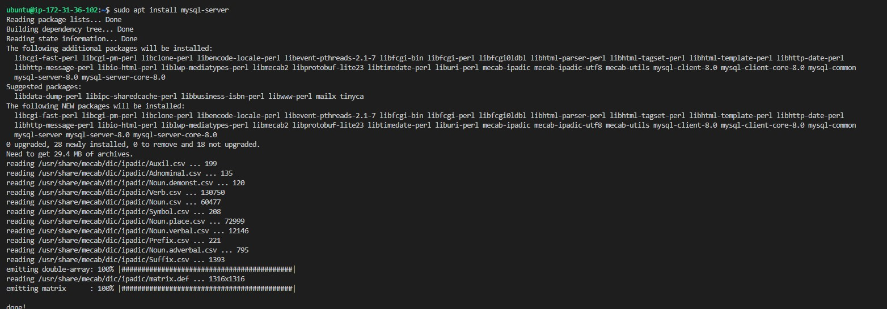

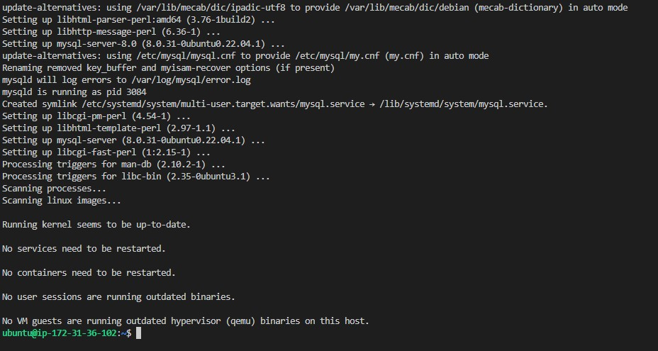

`After the installation was done. logged into the mysql console by running the command "sudo mysql" and I generated the output shown in the image below:`

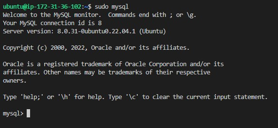

`After logging into mysql console, I defined the user password while the root password was set as mysql_native_password and the exit the mysql by running command "exit"`

`I started an interactive script by running the command "sudo mysql_secure_installation" in order to set security and generated the images below as output.`

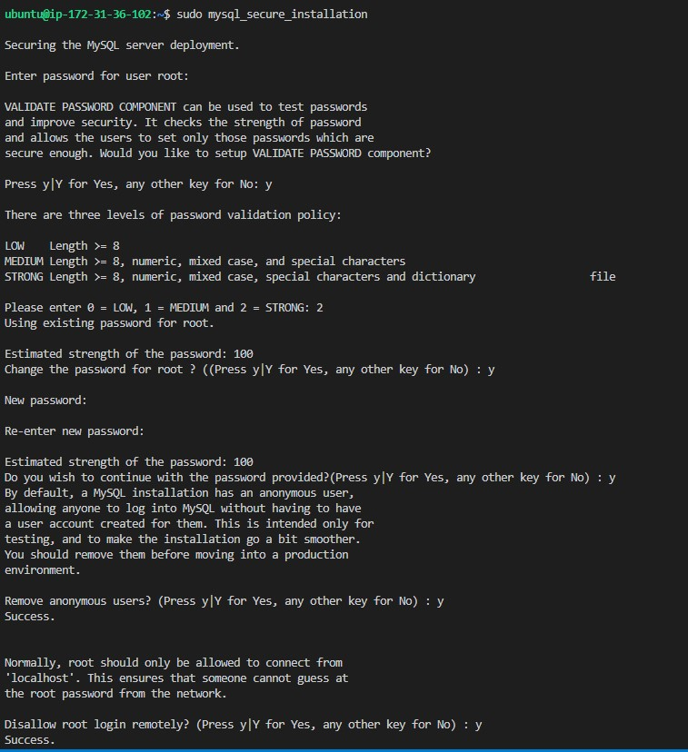

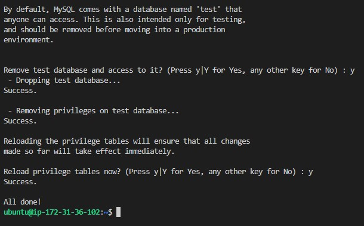

`To confirm if mysql security is workin as expected, I run command "sudo mysql -p" and output in the image displayed below was generated`

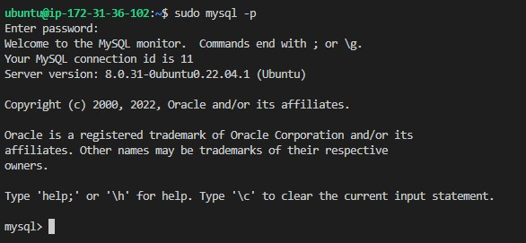


## INSTALLING PHP

## *creating bridge between php interpreter and web server*

`To create bridge between php interpreter and the web server, I run command "sudo apt install php-fpm php-mysql" and the below image was generated as output.`

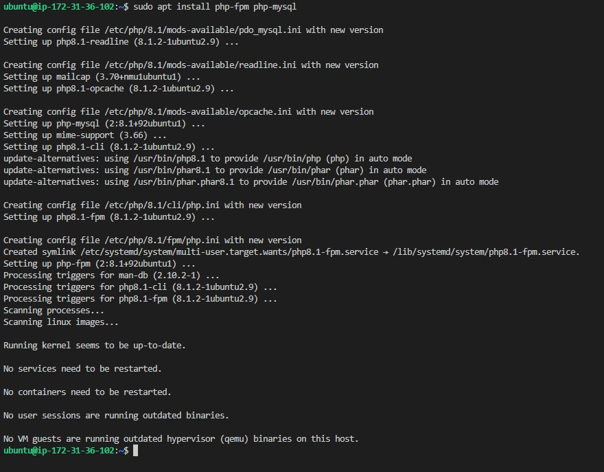


## CONFIGURING NGINX TO USE PHP PROCESSOR

`lempstackproject was used as domain name. Therefore, a directory was created for it by running the command "sudo mkdir /var/www/lempstackproject"`

`To create owner for the directory, I run command "sudo chown -R $USER:$USER /var/www/lempstackproject"`

`Then, I created a configuration file in Nginx's sites-available directory using nano command as command-line editor and I run command "sudo nano /etc/nginx/sites-available/lempstackproject"`

`I then create a new blank file by running the command below:`

```
{#/etc/nginx/sites-available/lempstackproject

server {
    listen 80;
    server_name lempstackproject www.lempstackproject;
    root /var/www/lempstackproject;

    index index.html index.htm index.php;

    location / {
        try_files $uri $uri/ =404;
    }

    location ~ \.php$ {
        include snippets/fastcgi-php.conf;
        fastcgi_pass unix:/var/run/php/php8.1-fpm.sock;
     }

    location ~ /\.ht {
        deny all;
    }

}

}
```

`I then tested my configuration for syntax error by running command "sudo nginx -t"`

`The image below shows the commands I run and the output I got when I tested my configuration.`

`I disabled the default Nginx host by running command "sudo unlink /etc/nginx/sites-available/default" and I reloaded the Nginx with command "sudo systemctl reload nginx"`

`To confirm that my configuration is workin as expected, I created a new index.html file in the var/www/lempstackproject as it was initially empty`

`So, I added the command "sudo echo 'Hello LEMP from hostname' $(curl -s http://169.254.169.254/latest/meta-data/public-hostname) 'with public IP' $(curl -s http://169.254.169.254/latest/meta-data/public-ipv4) > /var/www/lempstackproject/index.html"`


